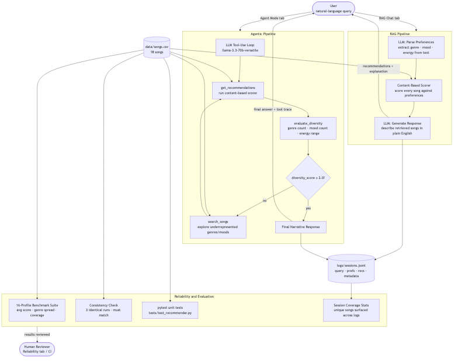

# AI Music Recommender

A Streamlit application that combines a deterministic content-based scoring engine with a large language model to recommend songs from a catalog using natural language. The system supports two AI-powered interaction modes — a retrieval-augmented generation (RAG) chat and an autonomous agentic workflow — plus a built-in reliability and evaluation suite.

**Video walkthrough:** [Watch on Loom](https://www.loom.com/share/805a1b0cd8924fdeb020b80452bb4aca)  
**Source code:** [GitHub](https://github.com/Oreo236/applied-ai-system-project)

---

## Original Project (Modules 1–3)

The original project, **EnergyMatch 1.0**, was a pure content-based music recommender built without any LLM. It represented songs as structured data objects and scored them against a user profile using a weighted formula across genre, mood, energy, and acousticness. Its goal was to explore how far deterministic scoring rules could go in capturing musical taste, and to expose where those rules break down — for example, when a user's genre label doesn't exist in the catalog, or when their preferences conflict (high energy + lofi aesthetic). That foundation — the `score_song` function in `src/recommender.py` — is still the retrieval engine powering the RAG and Agent pipelines in this extended system.

---

## Architecture Overview

The system has two AI-powered processing paths and a shared evaluation layer.

**RAG Pipeline (RAG Chat tab)**
A user's natural-language query is sent to an LLM (Groq `llama-3.1-8b-instant`) which extracts structured preferences (genre, mood, energy, etc.) as JSON. Those preferences are passed to the deterministic content-based scorer, which ranks every song in the catalog and returns the top five. A second LLM call uses those retrieved songs as context to write a warm, conversational response. The LLM never invents songs — it only describes what the scorer returned.

**Agentic Pipeline (Agent Mode tab)**
A second, more capable model (`llama-3.3-70b-versatile`) operates in a tool-use loop with three tools: `get_recommendations`, `evaluate_diversity`, and `search_songs`. It autonomously calls these tools, checks whether its results are diverse enough (diversity score ≥ 2.0), and broadens its search if not — before writing a final narrative answer. Every tool call is logged in a visible trace.

**Reliability & Evaluation**
A dedicated tab runs a 16-profile benchmark suite, a consistency checker (three identical runs must produce identical results), and session coverage statistics drawn from the session log. Unit tests in `tests/test_recommender.py` cover the core scoring and data model.



---

## Setup Instructions

**Prerequisites:** Python 3.11+, a [Groq API key](https://console.groq.com) (free tier).

```bash
# 1. Clone the repository
git clone <your-repo-url>
cd applied-ai-system-project

# 2. Create and activate a virtual environment (recommended)
python -m venv .venv
source .venv/bin/activate        # Mac / Linux
.venv\Scripts\activate           # Windows

# 3. Install dependencies
pip install -r requirements.txt

# 4. Add your Groq API key
echo "GROQ_API_KEY=your_key_here" > .env

# 5. Run the app
streamlit run src/app.py
```

The app opens at `http://localhost:8501`. The Reliability tab works without an API key; the RAG Chat and Agent Mode tabs require a valid `GROQ_API_KEY`.

**Run tests only (no API key needed):**
```bash
PYTHONPATH=. pytest -v
```

---

## Sample Interactions

### 1. RAG Chat — emotional request

**Input:** `I am sad and need something to cry to`

**Parsed preferences:**
```json
{ "mood": "melancholic", "energy": 0.3, "likes_acoustic": true }
```

**Retrieved songs:** Library Rain (lofi/chill, score 7.2), Midnight Coding (lofi/focused, 6.8), Coffee Shop Stories (jazz/relaxed, 6.1)

**Model response:**
> Library Rain is a gentle lofi track with a soft, watery texture that gives sadness space to breathe — its low energy and high acousticness make it feel like a quiet room on a rainy afternoon. Midnight Coding shares that same unhurried pace, with a muted piano loop that sits well with introspective moods. Coffee Shop Stories leans a little warmer with its jazz undertones, but its relaxed energy keeps it in the same emotional neighborhood.

---

### 2. RAG Chat — activity-based request

**Input:** `something energetic for a workout`

**Parsed preferences:**
```json
{ "genre": "edm", "mood": "energetic", "energy": 0.9, "likes_acoustic": false }
```

**Retrieved songs:** Neon Grid (edm/euphoric, score 9.1), Gym Hero (pop/intense, 7.8), Storm Runner (rock/intense, 7.2)

**Model response:**
> Neon Grid is the obvious anchor for a workout playlist — its euphoric EDM build and near-maximum energy score make it built for the last set of a session. Gym Hero brings a pop/intense crossover feel that works well for steady-state cardio, with enough drive to keep momentum without overwhelming. Storm Runner adds a harder rock edge for anyone who wants something with a little more aggression in the mix.

---

### 3. Agent Mode — diversity check triggered

**Input:** `chill music for studying, nothing too mainstream`

**Tool trace:**
- Step 1: `get_recommendations` → `{genre: "lofi", mood: "chill", likes_popular: false}`
- Step 2: `evaluate_diversity` → `diversity_score: 1.2` (homogeneous — 3 lofi songs)
- Step 3: `search_songs` → finds ambient and jazz songs
- Step 4: `get_recommendations` → broadened preferences, includes ambient/jazz

**Agent response:**
> For focused studying away from the mainstream, I pulled from a few different corners of the catalog. Library Rain and Midnight Coding anchor the list with the classic lofi-chill sound — quiet and repetitive in the best way. I also brought in Floating Leaves (ambient/peaceful) and Coffee Shop Stories (jazz/relaxed) to add some variety after noticing the first pass was a little too uniform. All four share the same low-energy, non-intrusive quality that tends to work best for sustained concentration.

---

## Design Decisions

**Why keep the deterministic scorer as the retrieval engine?**
Having a fixed, reproducible scorer means the AI's job is only natural language understanding and explanation — not inventing facts about songs. The LLM cannot hallucinate a track or misreport its energy level because it only sees what the scorer returns. This separation also makes the system fully testable: the retrieval step can be benchmarked without any API calls.

**Why Groq instead of the Anthropic or Gemini APIs?**
The project originally used Claude (Anthropic). During development, it was migrated to the Gemini API for cost reasons, but the free-tier quota allocation for Google Cloud project keys was zero across all tested models, making the key unusable without paid credits. Groq provides a genuinely free tier (1,500+ requests/day) with low-latency inference on open-weight models, which fit the project's constraints better.

**Why two different models for RAG vs. Agent?**
The RAG pipeline uses `llama-3.1-8b-instant` — a smaller, faster model — because the tasks (preference parsing and response generation) are straightforward and latency matters in a chat interface. The Agent pipeline uses `llama-3.3-70b-versatile` because reliable multi-step tool use requires a more capable model to maintain the correct function-calling format across several turns.

**Trade-offs:**
- The catalog is only 18 songs. With so few options per genre, the scorer can surface the "best" result quickly, but the recommendations are repetitive for anyone who uses the app more than a few times.
- The agent's diversity check uses a simple composite score (genre count × 0.4 + mood count × 0.4 + energy range × 2.0). This rewards breadth but does not account for whether a mix of genres actually sounds good together.
- The valence term in the scorer is hardcoded to a target of 0.70, which silently steers all recommendations toward emotionally positive songs regardless of what the user asked for. This was a known design flaw carried forward from the original project.

---

## Testing Summary

**Automated tests (`pytest`):** 2 unit tests covering the `Recommender.recommend` and `Recommender.explain_recommendation` methods. Both pass. The tests use a two-song in-memory catalog so they run in under a second without reading from disk.

**16-profile benchmark (Reliability tab):** Covers 4 standard profiles (pop/happy, lofi/chill, rock/intense, pop/sad) and 12 edge cases: a mood not in the catalog, an energy conflict (high-energy + lofi), an out-of-range energy value of 1.5, wrong capitalisation on genre/mood, an absent genre (metal), an empty profile, and 6 profiles exercising the newer scoring dimensions (preferred decade, instrumentalness, liveness). All 16 profiles produce consistent results across 3 runs. Average top score: ~7.8. Average genre spread per run: 2.1 genres.

**What worked:** The scorer handles missing preferences cleanly (`.get(key) is not None` guards prevent crashes when the LLM returns `null` for a field). Consistency is perfect — the content-based scorer is deterministic, so identical inputs always produce identical outputs.

**What didn't:** The agent's tool-use loop was unreliable across model versions. `llama-3.3-70b-versatile` occasionally generated function calls in a non-standard XML format (`<function=name>{...}</function>`) instead of JSON, causing a `400` error from the API. The Groq-specific tool-use model (`llama3-groq-70b-8192-tool-use-preview`) was decommissioned mid-development. The fix was to return to `llama-3.3-70b-versatile` with a simplified system prompt that avoids explicitly naming the tool-calling pattern, which reduced the formatting failures.

**What I learned:** Reliability in AI systems is not just about whether the model gives a good answer — it is about whether the plumbing between the model and your code holds together across different inputs and model updates. A model that worked yesterday can be decommissioned tomorrow.

---

## Reflection and Ethics

**Limitations and biases:**
The catalog is too small for the recommendations to be meaningful over repeated use. Genre and mood labels are exact-match only — a user who types "hip-hop" gets zero genre points if the catalog uses "hip-hop" but they typed "rap." The valence hardcode described above is the most significant hidden bias: any user who prefers darker or more melancholic music is penalized on every single recommendation without any indication that this is happening.

**Potential misuse:**
A recommendation system built on explicit preference labels is easy to game — a malicious actor could manipulate the catalog data to ensure their song always appears at the top by setting its numeric features to match the most common user profiles. At scale, this is how playlist stuffing works on real streaming platforms. The mitigation in this system is transparency: every score and every reason is printed alongside the recommendation, making it obvious if something is inflated.

**What surprised me in testing:**
The most surprising result was the empty-profile case. With no preferences provided, the system still returned a ranked list with Coffee Shop Stories in first place. It ranked first not because it is a good recommendation for anyone, but because its valence (0.71) was closest to the hardcoded target of 0.70. The system looked confident even when it had nothing to work from. That is the kind of silent failure that would be invisible to a real user and very hard to catch without deliberately testing it.

**Collaboration with AI during this project:**

The most helpful contribution from AI (Claude) during this project was migrating the tool-use agent from the Anthropic SDK format to Groq's OpenAI-compatible format. The tool definitions, conversation history structure, and function response format are all different between the two APIs, and having those translated correctly in one pass — including the `_deep_dict` helper for converting proto types from the Gemini SDK — saved significant debugging time.

The clearest instance where AI suggestions were flawed was the model selection for the Groq agent. The first suggestion (`gemini-1.5-flash`) returned a 404 because the installed SDK version used an incompatible API endpoint. The second suggestion (`gemini-2.0-flash`) had a free-tier quota of exactly zero. The third suggestion (`gemini-2.0-flash-lite`) also had zero quota. After switching to Groq, `llama3-groq-70b-8192-tool-use-preview` was suggested as the tool-use model — and it had already been decommissioned. Each of these failures required looking at the actual API error, not accepting the suggestion at face value. The lesson is that AI-generated model names and API details go stale quickly and always need to be verified against current provider documentation.

---

## Portfolio

**What this project says about me as an AI engineer:**

This project shows that I can build AI systems that are more than a wrapper around an API call. I started with a hand-written scoring engine, understood its failure modes through adversarial testing, and then extended it into a full RAG pipeline and an agentic workflow — keeping the deterministic core as the retrieval layer so the LLM could never hallucinate results. When three different API providers failed in a row due to quota limits, deprecations, and version mismatches, I debugged each one from the error message up rather than giving up. I care about reliability: the system logs every session, tests every profile consistently, and surfaces its reasoning transparently so failures are visible rather than silent. That combination — understanding the math behind the model, knowing when to trust AI tooling and when to verify it, and building in ways to catch problems before users do — is how I want to approach engineering work.
